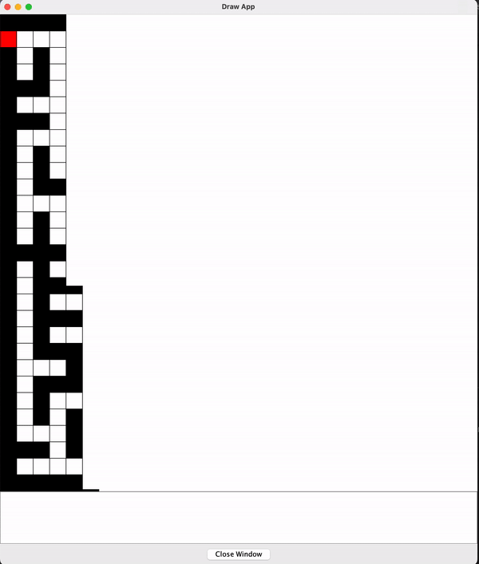

# Maze

## Introduction

The maze.c is written by C language using "graphics.h" and run with drawapp-2.0.app to draw the picture. Deep Search First (DFS) algorithm is used to create a random maze and find a path to fix the maze as well. The route may not be the shortest one. The maze solver, robot, would find the route out of maze step by step, so you can watch and see how it solve a maze.

## Sample output



## Changing the maze size

You can change the size of the maze by changing maze_size in line 19 of maze.c file. Reminder: the maze size can only be an odd number or it would generate a maze that may have no route out.

## Compiling

The program is compiled using gcc compiler.

First create a new terminal in the folder where the file is located

Then type:

```bash
gcc -o maze maze.c graphics.c 
```

Then run with:

```bash
./maze | java -jar drawapp-2.0.jar
```

## Reference

Build a struct stack:

+  https://www.programiz.com/dsa/stack

Generate maze using DFS:

+ https://www.bilibili.com/video/BV1Vt411U7nr/?p=5&vd_source=be7f3cc5dac83b7494ce11fcad345578

+ https://www.baeldung.com/cs/maze-generation#:~:text=Another%20way%20of%20generating%20a,as%20visited%2C%20and%20so%20on.

DFS robot moving algorithm:

+  https://medium.com/swlh/solving-mazes-with-depth-first-search-e315771317ae#:~:text=In%20order%20to%20figure%20out,has%20nowhere%20else%20to%20go. 
+ https://medium.com/swlh/solving-mazes-with-depth-first-search-e315771317ae